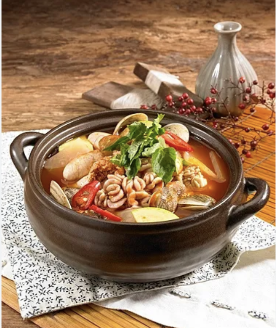

# 칼칼한 알탕

> ⏱️ 조리시간: 13분 | 🍽️ 1인분 | 난이도: ⭐ 쉬움

## 📝 재료
- 명란 또는 대구알 (냉동 가능) — 150g
- 두부 — 1/4모
- 대파 — 1/3대
- 애호박 — 1/4개 (없으면 생략 가능)
- 느타리버섯 또는 팽이버섯 — 한 줌 (없으면 생략 가능)
- 당면 — 50g (미리 30분 불려두거나, 바로 넣을 경우 물을 50ml 추가)
- 물 — 350ml
- 고추장 — 1/2큰술
- 고춧가루 — 1큰술
- 간장 — 1큰술
- 다진 마늘 — 1/2큰술 (없으면 마늘 가루 1/4큰술)
- 설탕 — 1/2작은술
- 소금 — 약간
- 후추 — 약간
- 참기름 — 1/2작은술 (있으면)

## 👨‍🍳 만드는 법
1. 두부는 한 입 크기로 깍둑썰기하고, 대파는 어슷썰기, 애호박은 반달 모양으로 썰어요. 버섯은 먹기 좋게 손으로 찢어두세요.
2. 냄비에 물 350ml를 넣고 센 불로 끓이다가 고추장, 고춧가루, 간장, 다진 마늘, 설탕을 넣고 잘 풀어줘요.
3. 국물이 끓기 시작하면 애호박과 버섯을 먼저 넣고 2분간 끓여요.
4. 당면을 넣어요. 미리 불려둔 당면은 이 단계에서 바로 넣고, 불리지 않은 당면은 물 50ml를 추가로 부은 뒤 넣어요. 당면이 반투명하게 익을 때까지 2~3분간 끓여요.
5. 알과 두부를 조심스럽게 넣고 중불로 줄여요. 알이 익을 때까지 4~5분간 끓여요. (알을 너무 오래 끓이면 터질 수 있으니 주의하세요!)
6. 대파를 넣고 소금, 후추로 간을 맞춰요. 불을 끄기 직전 참기름을 한 방울 넣으면 풍미가 UP!
7. 그릇에 담아 따끈하게 바로 먹으면 완성이에요!

## 💡 꿀팁
- 냄비 하나만 쓰면 설거지 끝! 재료를 미리 썰어두면 10분 안에도 가능해요.
- 알을 냉동 상태로 사용할 경우, 흐르는 찬물에 5분 정도 해동한 뒤 넣으면 훨씬 빨리 익어요.
- 칼칼함을 더 원한다면 청양고추를 1개 어슷썰어 함께 넣어보세요.
- 두부 대신 순두부를 사용하면 더 부드럽고 국물이 걸쭉해져요.
- 알 종류는 명란, 대구알, 연어알 어떤 것도 OK! 마트 냉동 코너에서 쉽게 구할 수 있어요.
- 당면은 찬물에 30분 불려두면 더 쫄깃하게 익어요. 시간이 없을 땐 바로 넣어도 되지만, 물을 50ml 더 추가해야 국물이 너무 줄지 않아요. 당면이 국물을 많이 흡수하므로 오래 끓이지 않도록 주의하세요.
- 남은 국물에 밥을 말아서 먹으면 진짜 꿀맛이에요.
