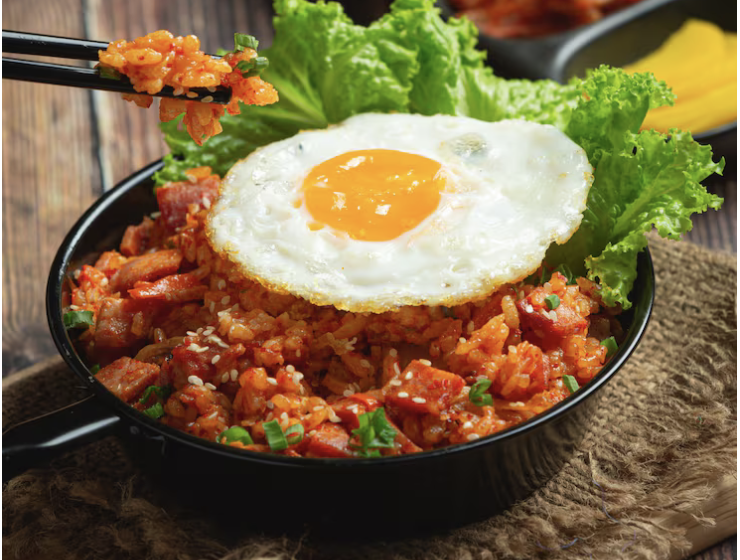

# 김치볶음밥

> ⏱️ 조리시간: 10분 | 🍽️ 1인분 | 난이도: ⭐ 쉬움

## 📝 재료
- 밥 — 1공기 (200g)
- 김치 — 100g (약 1/4컵)
- 달걀 — 1개
- 청양고추 — 1~2개 (매운 정도에 따라 조절)
- 햄 또는 참치캔 — 50g (선택)
- 참기름 — 1작은술
- 김치 국물 — 1큰술
- 식용유 — 1큰술
- 간장 — 1/2작은술
- 설탕 — 1/2작은술

## 👨‍🍳 만드는 법
1. 김치를 가위로 먹기 좋은 크기(2~3cm)로 잘라두세요. 도마 없이 그릇 위에서 바로 잘라도 돼요!
2. 청양고추를 가위로 송송 썰어두세요. 씨를 제거하면 덜 맵고, 씨째 넣으면 더 매콤해요!
3. 팬에 식용유를 두르고 중불로 예열한 뒤, 청양고추와 김치, 햄을 함께 넣고 1~2분 볶아주세요. 고추의 매운 향이 기름에 배어나와 훨씬 깊은 맛이 나요!
4. 밥을 넣고 김치와 잘 섞어가며 2~3분 볶아주세요. 이때 김치 국물, 간장, 설탕을 넣고 고루 섞어주세요.
5. 밥을 팬 한쪽으로 밀어두고, 빈 공간에 달걀 프라이를 만들어주세요. 반숙으로 익히면 더 맛있어요!
6. 불을 끄고 참기름을 둘러 마무리하세요. 달걀을 밥 위에 올리면 완성!

## 💡 꿀팁
- 밥은 전날 남은 찬밥을 사용하면 더 맛있어요. 수분이 적어서 볶음밥이 더 잘 볶아집니다.
- 햄 대신 참치캔, 베이컨, 소시지 등 냉장고에 있는 재료를 자유롭게 넣어도 돼요.
- 청양고추 대신 고추장 1작은술을 추가해도 비슷하게 매콤한 맛을 낼 수 있어요.
- 매운 걸 잘 못 먹는다면 청양고추 씨를 제거하거나 1/2개만 사용해 보세요. 어렵지 않아요!
- 김치가 오래될수록 신맛이 강해져 더 깊은 맛이 나요. 묵은지를 사용하면 더욱 감칠맛 있어요.
- 달걀을 처음부터 함께 볶아 스크램블 형태로 만들어도 맛있고 설거지도 줄어들어요.
- 팬 하나로 요리가 완성되니 설거지 걱정은 NO! 팬은 키친타월로 닦으면 더 빠르게 뒷정리할 수 있어요.
