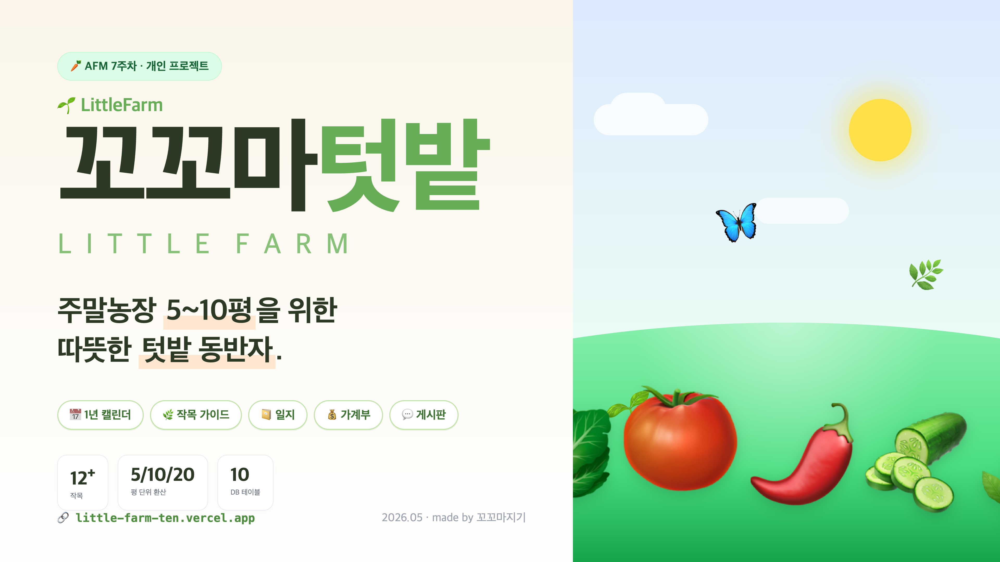

# 🌱 꼬꼬마텃밭 (LittleFarm)



> **주말농장 5~10평을 위한 따뜻한 텃밭 동반자** — 1년 캘린더, 작목 가이드(평수 환산), 일지, 가계부, 게시판을 한 손바닥 안에서.

> 📽 발표 첫 슬라이드로 그대로 사용: [`cover.png`](./cover.png) (1920×1080) · 디자인 소스: [`cover.html`](./cover.html)

🔗 **Live**: https://little-farm-ten.vercel.app
📄 기획 문서: [MISSION.md](./MISSION.md) · [AUDIENCES.md](./AUDIENCES.md) · [DEV.md](./DEV.md)

---

## 🚀 5분 사용법 (처음 오신 분께)

### 1) 비로그인으로 둘러보기

| 화면 | 무엇을 하나요 |
|---|---|
| 🏠 **홈** ([/](https://little-farm-ten.vercel.app)) | 이번 달 시즌 작목 + 친구들 텃밭 일지 둘러보기 |
| 📅 **캘린더** | 월별로 무엇을 심고/가꾸는지 카드로 한눈에 |
| 🌿 **작목 가이드** | 12+종 작목의 5/10/20평 기준 작업량 |

### 2) 가입하고 시작하기

1. 우상단 **"가입"** → 이메일 + 닉네임 + 동네 + 🦊 이모지 아바타 선택
2. 가입하면 **"이번 주말 어떠세요?"** 모달이 자동으로 등장 → 추천 작목 + 내 작물의 이번 달 작업 안내
3. **"오늘 다시 보지 않기"** 체크박스로 하루 동안 숨김 가능

### 3) 작목 등록 → 일지 쓰기 → 가계부 정리

```
🌿 작목 가이드에서 마음에 드는 작목 선택
   └─ "내 5평 텃밭에 추가" → 마이페이지에 등록됨
       └─ + 일지 쓰기 (이미지 업로드 + 다중 작목 태깅 + 공개범위)
           └─ 💰 가계부에 모종비/비료 기록
```

> **💡 목록에 없는 작물?** 일지 작성 폼의 **`+ 새 작목`** 칩을 누르면 즉석 추가돼요.

### 4) 작목 가이드가 비어있으면 직접 채워주세요

직접 추가한 작목이나 정보가 부족한 작목 상세 페이지에 **"📝 추가 정보 만들기"** 노란 배너가 뜹니다.
- 한 줄 소개, 시즌, 햇빛/물주기/흙
- 월별 작업 (모종/시비/관수/수확/풀뽑기/병해충관리)을 5/10/20평 분량으로 추가

> 🌿 모두가 함께 채우는 위키 스타일이에요.

### 5) 다른 텃밭러와 소통

- 🌸 **둘러보기** : 다른 사람의 공개 일지
- 💬 **게시판** : 질문 / 자랑 / 정보 / 자유 4보드 + 댓글 + ❤️
- **카카오 공유** (예정 v1.1)

---

## 🧪 테스트 계정

| 역할 | 이메일 | 비밀번호 |
|---|---|---|
| 👑 관리자 | `admin@littlefarm.test` | `admin1234` |
| 회원 (텃밭 데이터 풍부) | `haneul@littlefarm.test` | `farmer123` |
| 회원 | `minji@littlefarm.test` | `farmer123` |
| 회원 | `jisoo@littlefarm.test` | `farmer123` |

---

## 🛠 로컬 실행

```bash
npm install
node seed.js           # 작목 12 + 작업 47 + 사용자 4 + 일지/가계부/게시판 샘플
node server.js         # http://localhost:3001
```

`seed.js`는 ImageKit에 12종 작목의 hero 이미지를 SVG로 업로드하고 URL을 DB에 기록합니다.

### 환경변수 (`.env`)

```env
DATABASE_URL=postgresql://...supabase.com:6543/postgres
JWT_SECRET=replace-me
IMAGEKIT_PUBLIC_KEY=public_xxx
IMAGEKIT_PRIVATE_KEY=private_xxx
IMAGEKIT_URL_ENDPOINT=https://ik.imagekit.io/your_id
GEMINI_API_KEY=AIza...   # 작목 가이드 자동 생성용 (Google Gemini)
PORT=3001
```

### Vercel 배포

```bash
vercel             # preview
vercel --prod      # production
```

`vercel.json`이 `/api/*` → `server.js`, 그 외 → `index.html`로 rewrite. 환경변수는 Vercel 프로젝트 설정에 동일하게 등록하세요.

---

## 🏗 기술 스택

| 영역 | 선택 |
|---|---|
| Backend | Node.js + Express 5, `pg`, `bcryptjs`, `jsonwebtoken` |
| Frontend | React 18 (CDN) + Babel(JSX) + Tailwind (CDN), 해시 라우팅 |
| DB | Supabase Postgres — 테이블 prefix **`small_forest_`** |
| Storage | ImageKit (클라이언트 직접 업로드 + 서버 HMAC 서명) |
| Deploy | Vercel (`@vercel/node` + 정적) |

---

## 🗄 데이터베이스 (10 테이블)

```
small_forest_users         사용자 (member|admin)
small_forest_crops         작목 마스터 (12+종 시드, 사용자 추가 가능)
small_forest_crop_tasks    작목 월별 작업 (5/10/20평 환산값)
small_forest_user_crops    내가 키우는 작물
small_forest_logs          농사일기 (사진 + 공개범위)
small_forest_log_crops     일지 ↔ 작목 다대다 (다중 태깅)
small_forest_budgets       가계부 (수입/지출)
small_forest_posts         게시판 (질문/자랑/정보/자유)
small_forest_comments      댓글
small_forest_post_likes    좋아요
```

서버 첫 요청 시 `CREATE TABLE IF NOT EXISTS`로 자동 생성됩니다.

---

## ✨ 주요 기능

| # | 기능 | 비고 |
|---|---|---|
| F1 | 이메일 가입/로그인 (JWT 7일) + 이모지 아바타 + 시·도 선택 | |
| F2 | 1년 캘린더 (월 이동, 비로그인 열람) | |
| F3 | 작목 가이드 (5/10/20평 환산 토글) | 카테고리/초보 필터 |
| F4 | 농사일기 CRUD + ImageKit 직접 업로드 (5장) | **다중 작목 태깅**, 공개범위 3단계 |
| F5 | 가계부 (수입/지출 + 카테고리 + 월별 합계) | |
| F6 | 게시판 4보드 + 댓글 + ❤️ | |
| F8 | 시기 알림 대시보드 모달 | **체크박스로 오늘 숨김** |
| F10 | 관리자 콘솔 (통계/사용자/작목) | |
| F11 | RBAC (비로그인/회원/관리자) | |
| ➕ | **작목 즉석 추가** (`+ 새 작목` 칩) | 일지 작성 흐름을 끊지 않음 |
| ➕ | **작목 정보·작업 보강** (위키 스타일) | 비어있는 가이드를 회원이 채움 |
| ➕ | **일지 인라인 ✎ 수정 / ✕ 삭제** | 목록에서 바로 |

> 다음 차수 (v1.1): 자재 결제(Toss), 카카오 공유, Gemini AI 보강

---

## 🗺 페이지 / 라우트 (해시)

```
#/                          홈 (이번 달 캘린더 + 친구 일지)
#/calendar, /calendar/YYYY-MM  월별 캘린더
#/crops                     작목 12+종 그리드 + 필터
#/crops/:id                 작목 상세 (5/10/20평)
#/crops/:id/edit            작목 정보·작업 보강 폼 ⭐
#/login, #/signup           인증
#/me                        프로필 + 내 작물 + 최근 일지 3건
#/me/logs                   내 일지 목록 (인라인 수정/삭제)
#/logs/new, /:id, /:id/edit 일지 작성/상세/수정
#/me/budget                 가계부 + 합계
#/feed                      공개 일지 둘러보기
#/board                     게시판 4탭
#/posts/new, /:id           글 쓰기/상세
#/admin                     관리자 대시보드 (👑)
```

---

## 🔌 API 요약

```http
# Public
GET   /api/health
GET   /api/categories
GET   /api/calendar?month=YYYY-MM
GET   /api/crops?category=&beginner=&month=
GET   /api/crops/:id
GET   /api/posts?board=&q=
GET   /api/posts/:id
GET   /api/logs/public/feed
GET   /api/logs/:id                # 비공개는 본인만

# Auth
POST  /api/auth/signup
POST  /api/auth/login
GET   /api/auth/me
PATCH /api/auth/me

# Member
GET   /api/upload/auth                  # ImageKit 단명 서명
GET   /api/me/dashboard                 # 시기 알림 데이터
GET   /api/me/crops    POST   /api/me/crops    DELETE /api/me/crops/:id
GET   /api/me/logs     POST   /api/logs        PUT/DELETE /api/logs/:id
GET   /api/budgets     POST   /api/budgets     DELETE /api/budgets/:id
GET   /api/budgets/summary?month=
POST  /api/posts       DELETE /api/posts/:id
POST  /api/posts/:id/comments
POST  /api/posts/:id/like   DELETE /api/posts/:id/like

# 작목 보강 (회원 누구나, 위키 스타일)
POST  /api/crops/quick                  # 즉석 추가 (이름+카테고리)
PUT   /api/crops/:id/info               # 메타 보강 (시즌/햇빛/물/흙/요약)
POST  /api/crops/:id/tasks              # 월별 작업 추가
DELETE /api/crops/:id/tasks/:taskId     # 관리자만

# Admin
GET    /api/admin/stats
GET    /api/admin/users    DELETE /api/admin/users/:id
POST   /api/admin/crops    PUT/DELETE /api/admin/crops/:id
POST   /api/admin/posts/:id/hide
```

---

## 🛡 권한 매트릭스

| 자원 | 비로그인 | 회원 | 관리자 |
|---|---|---|---|
| 캘린더 / 작목 가이드 | ✓ 열람 | ✓ + 즐겨찾기 + 정보 보강 | ✓ + 작업 삭제 |
| 게시판 열람 | ✓ | ✓ | ✓ |
| 게시판 작성·댓글·좋아요 | ✗ | ✓ | ✓ + 숨김 |
| 일지 | ✗ | 본인만 (visibility별) | 모든 일지 모더레이션 |
| 가계부 | ✗ | 본인만 | ✗ (개인정보) |
| 사용자/작목 관리 | ✗ | ✗ | ✓ |

---

## 📷 ImageKit 통합

1. 클라이언트가 `GET /api/upload/auth`로 단명 서명 발급 (HMAC-SHA1)
2. `POST https://upload.imagekit.io/api/v1/files/upload`에 파일 직접 업로드
3. 응답 `url`을 DB(JSONB `image_urls`)에 기록

작목 hero 이미지는 SVG로 업로드하되 `?tr=orig-true` 쿼리로 원본 SVG를 받아 브라우저 native 이모지 폰트로 렌더링 (PNG 변환 시 codepoint 박스로 깨지는 문제 회피).

---

## 🎨 톤 / 디자인

- 색상: 연두(`leaf-500 #67ac57`) · 베이지(`#fbf6e9`) · 주황(`#f97e30`)
- 둥근 모서리(`rounded-2xl`), 큰 여백, 친절체 마이크로카피 ("이번 주말 어떠세요?")
- 모바일 우선 + 데스크톱 5열 그리드 + 모바일 하단 5탭 nav

---

## 🔧 트러블슈팅

| 증상 | 원인 / 조치 |
|---|---|
| `DB init failed` | Supabase 프로젝트 휴면 → 대시보드에서 resume |
| 이미지 업로드 401 | 서명 만료 (5분) → 페이지 새로고침 후 다시 시도 |
| 로그인 후 대시보드 모달 매번 등장 | "오늘 다시 보지 않기" 체크박스 → 자정까지 숨김 (`localStorage.dashboard_dismissed_*`) |
| 라이브에서 작목 hero 이미지가 hex 박스로 보임 | URL에 `?tr=orig-true` 누락 — `regen_images.js` 재실행 |
| 일지 작성 시 새 작목이 목록에 없음 | 폼 끝 `+ 새 작목` 칩으로 즉석 추가 |

---

🌱 made for AFM week-7 quest.
